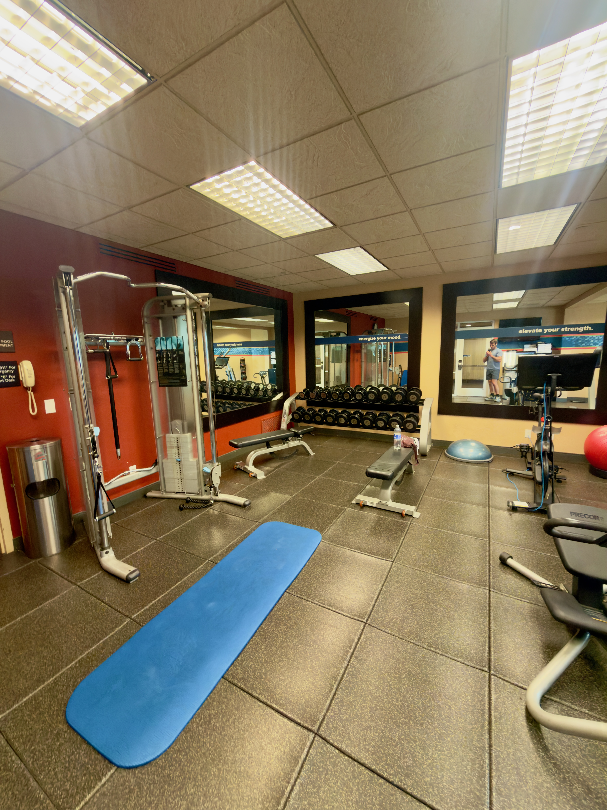
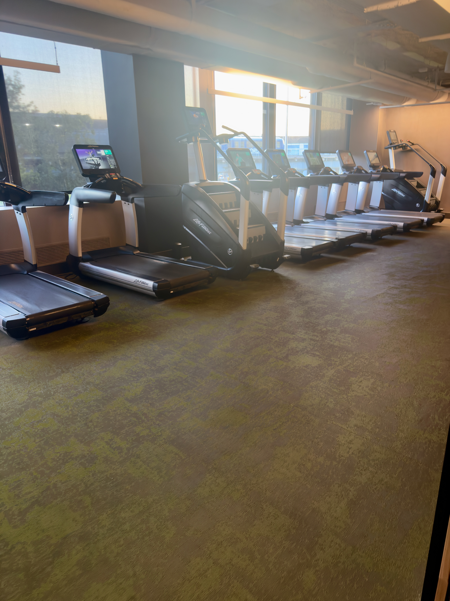
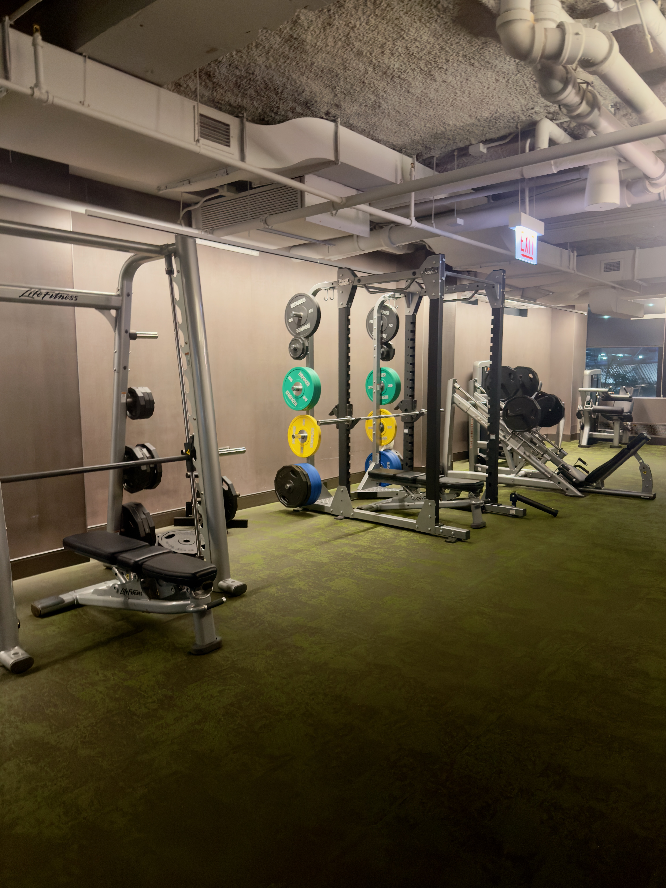

Running notes on layover hotels: what the gym actually has, and anything else worth knowing.

<!--
  HOW TO ADD A HOTEL (two steps):

  1. Add a row to the table. The first column is a link to the hotel's section
     further down: [Name](#some-id). The "#some-id" must match the {#some-id}
     you put on that hotel's heading in step 2. Keep ids short, lowercase, no
     spaces: airport code + hotel name works well, e.g. #ida-best-western.

  2. Add a "## Hotel name {#some-id}" section at the bottom, in the same order
     as the table. For photos, drop the files into THIS folder
     (content/hotel-tracker/) and add one line per photo, exactly like in a post:

     

  Rating: use 1-5 stars (⭐). Keep the table columns short so it stays readable
  on a phone.
-->

| Hotel | Airport | Gym | Rating | Notes |
| --- | --- | --- | --- | --- |
| [Best Western](#ida-best-western) | IDA | Cable machine, dumbbells | ⭐⭐ | Bike rental |
| [Hilton](#ord-hilton) | ORD | Full gym | ⭐⭐⭐⭐⭐ | Co-lo w/ airport |---

## Best Western, Idaho Falls {#ida-best-western}

**Gym:** not bad for a small hotel, complete with a cable/pulley machine.

**Other:**  bike rental from the front desk, and the falls are a short ride away.

  
  


## Hilton, Chicago Airport {#ord-hilton}

**Gym:** Top tier - paid gym quality. Good treadmills/cardio equipment, several machines (lame, I know), and FREAKING SQUAT RACK. 

**Other:** Hotel is connected to airport. ~20 min to typical SKW gates. 


  
  


<!-- Photos go here, one per line:   -->
