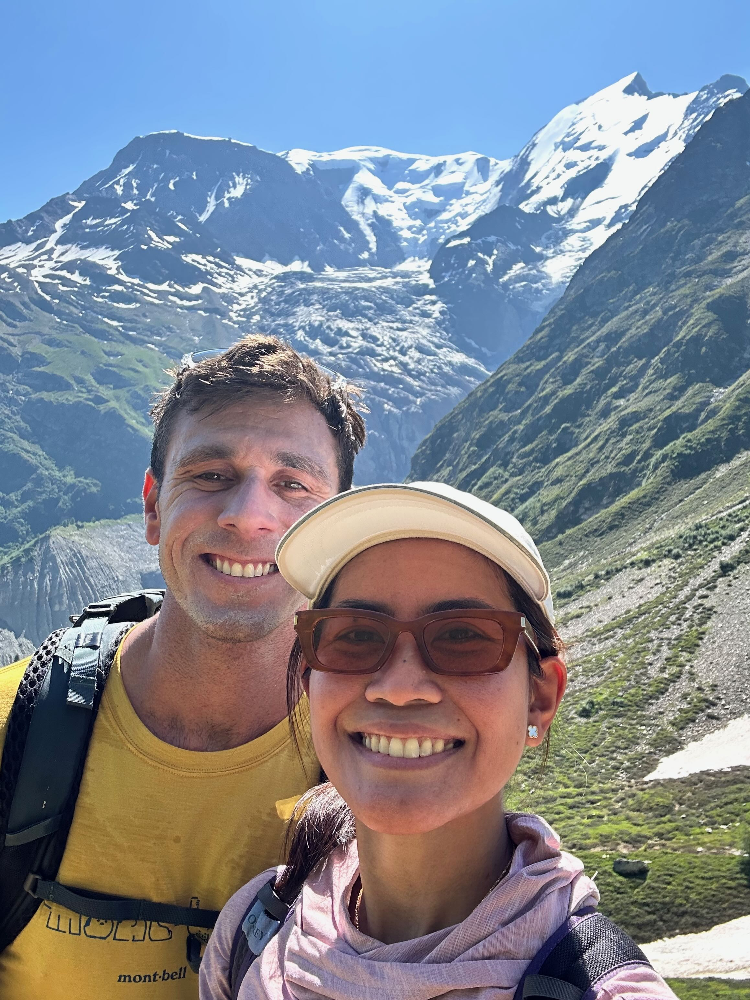

I've wanted to start a blog for about three years. This is the part where I
finally did, and the reasoning behind how it's built.

#### Background

I've long been the "techy hobby person" relative to the people I work with and
love. I've built custom tools for expense tracking and pilot hours. On my few
days off you can usually find me at a local wood workshop, learning some skill
badly or building a trinket for someone. I've used more markdown editors,
vector designers, IDEs, and email clients than I could possibly tally. I run
both Home Assistant and HomeKit at home, and there's a Raspberry Pi 4B on my
network hosting PhotoPrism.

My job takes me to a lot of unique places across the country. When I can string
together more than seven days off, I'll strap on a 60L pack for four days in
some wilderness where I'll see more bears than people. I take a lot of photos of
landscapes, even though they never quite do the real thing justice.

My life isn't particularly special, but I've always thought it'd be nice to
document the projects and the travel. Mostly for me — but out there, in case
anyone else finds it interesting.

I signed up for a WordPress.com account sometime in 2024 and paid for a custom
domain. I didn't like it.

My inner nerd hated that a "quick start" template was forced on me. I wanted to
see the source of my own site, not scroll preview thumbnails for an ungodly
number of themes. I wanted something simple, not convoluted and full of
AI-generated filler. Somewhere between that signup and now I learned about the
missing piece: **static sites.** A handful of `.toml` and `.md` files that a
generator turns into a website, as simple or as complex as I decide to make it.

#### Design requirements

1. **Fast to write in.** I need to open my laptop and get something down during
   the twenty minutes between flights, or the half hour I give myself for lunch
   mid-project. I'm happy to fight the nitty-gritty during setup, but the actual
   posting has to be frictionless.
2. **Photos from my PhotoPrism instance.**
3. **Text-based editing.** Nothing resembling the WordPress.com visual builder.

That's it.

#### The tools

| | |
| --- | --- |
| **Hugo** | static site generation |
| **Blowfish** | theme |
| **Cloudflare Workers** | hosting |
| **Cursor** | writing posts and editing the site |
| **PhotoPrism** | photo storage |
| **Obsidian** | *planned* — not set up yet |

Hugo was the least friction: a single `brew install hugo`. Blowfish, if you
haven't come across it, is genuinely great. This is my first static site so I
have no baseline, but it gives a very wide array of building blocks and I doubt
I'll want for a feature. It supports embedded YouTube videos, GitHub repos, and
plenty more, mostly through what it calls **shortcodes** — small snippets you
drop into the markdown of a page.

Right now I'm writing everything in Cursor, same place I edit the site itself.
Obsidian is on the list — the idea is to point a vault at the `content/` folder
so I can draft on the couch without thinking about the repo — but I haven't set
it up, and Cursor is working fine.

