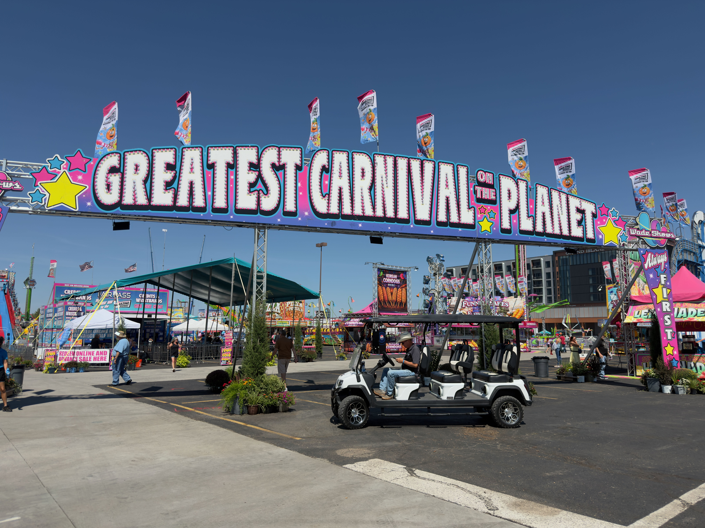

Two days after committing to do this, here's where things actually stand.

#### Working

**The site builds and deploys.** Hugo generates it, the repo lives on GitHub,
and a push triggers a build that puts it on Cloudflare Workers. No server to
maintain, nothing to patch. Writing a post is three commands — `add`, `commit`,
`push` — and about a minute later it's live.

**Projects are their own thing.** Rather than making "projects" just another
tag, each project gets its own page, and posts attach themselves to it with one
line of front matter. So my in-progress bread box gets a page that explains what it is, and
every update I write about it collects underneath automatically. Same mechanism
for this website, which is why this post shows up under it.

**The flight map draws.** Every leg I've logged, pulled out of my logbook as
GeoJSON and rendered with Leaflet — 53 airports and 63 routes. This was the
single feature that killed WordPress for me. Embedding a custom map there meant
paying for a plan that allows plugins. Here it's a text file and forty lines of
JavaScript.

It fought me for a while. Three separate things broke it, all silently: markdown
quietly mangling the JavaScript, the theme defining its own global variable that
happened to collide with Leaflet's, and the map measuring its own width before
the page had finished laying out. All three produced a blank grey box and zero
error messages. Shoutout to Claude for fixing it.
**PhotoPrism moved.** It used to answer at this apex domain, which the blog now
needs. It lives at its own subdomain — the **Photos** link at the bottom of
every page.

#### Not working: the media problem

This is my largest

Almost every travel photo I take is on my iPhone. Some project documentation is
video, also on my iPhone, but occasionally something comes off a Fuji X-T2 or GoPro Hero 9 (thanks Jobelle!). Right now there is no system connecting any of that to this site.

I have a PhotoPrism instance, and it's good at being a library — it holds the
photos, it indexes them, I can find things in it. What it isn't is a pipeline. I
don't have a repeatable way to get "the twelve photos from that trip" out of my
phone, into PhotoPrism, sized appropriately, and into a post. At the moment it's
manual: find the photo, export it, drop it in the post folder, hope I remember
which one I already used.

Some open questions I don't have answers to yet:

- Should photos live in the site repo, or be served from somewhere separate?
- Video is the harder problem — it's large, and I don't want it in a git repo.
- Is there a sane way to pull a specific PhotoPrism album into a post, rather
  than hand-picking files?

That's the next thing to solve. The writing part is fine now; it's the pictures/media
that are still a mess.

#### "Shortcode" 
Blowfish has a pretty neat thing called "shortcode", which are simple text calls within a markdown file that adds tons of extra functionality. For example, below is the Git repo for this very site! For reasons unknown, I cannot get Youtube shortcode embeds to function correctly.



#### Next 

- A second map for places I've actually visited, not just flown through
- Figure out the media pipeline
- Find and learn how to use simple video editing software
- Actually set up Obsidian, which is still just a plan
- Backwrite a few trips: 
  - Philippines 2025
  - Tour du Mont Blanc 2026
  - SE Asia 2020-2024 (not really a trip, but some highlights from life there)
- Write about a cool cherry and maple breadbox I designed and am making
- **I am just finishing a four day trip where I was mostly in Grand Island, NE during the start of the Nebraska State Fair. Lots of corndogs and goats! Tomorrow, I will write my first travel post on the neat things I saw during my visit.**

