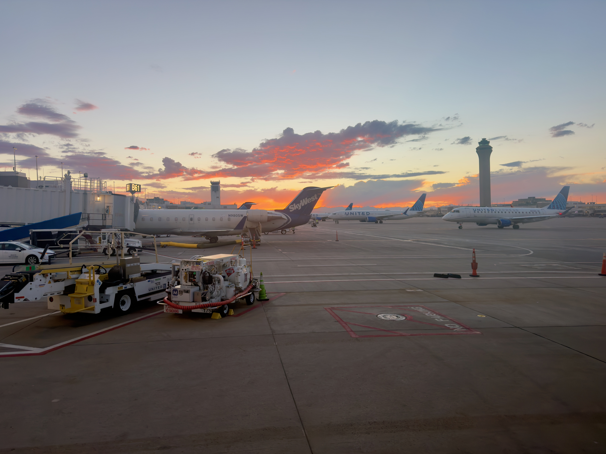
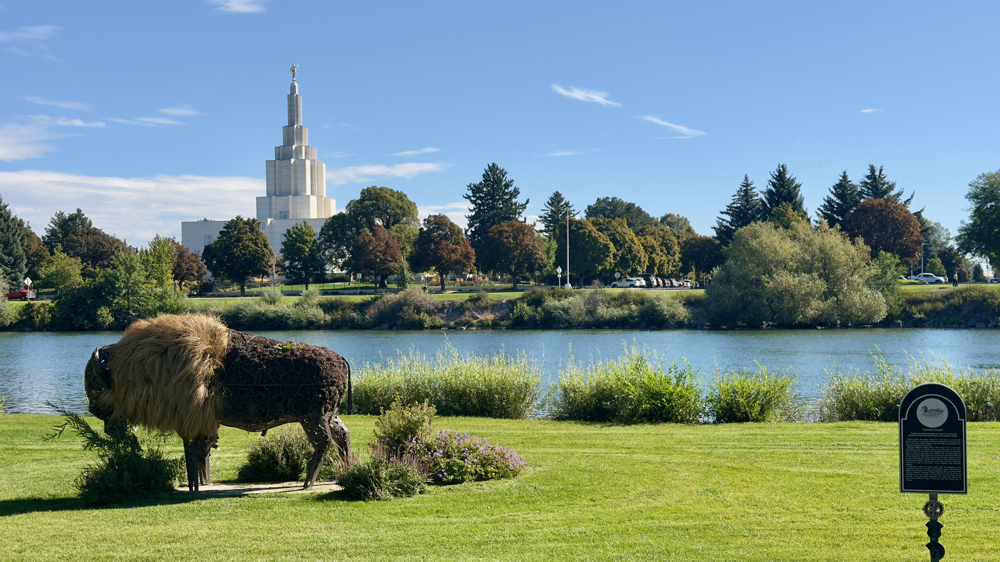
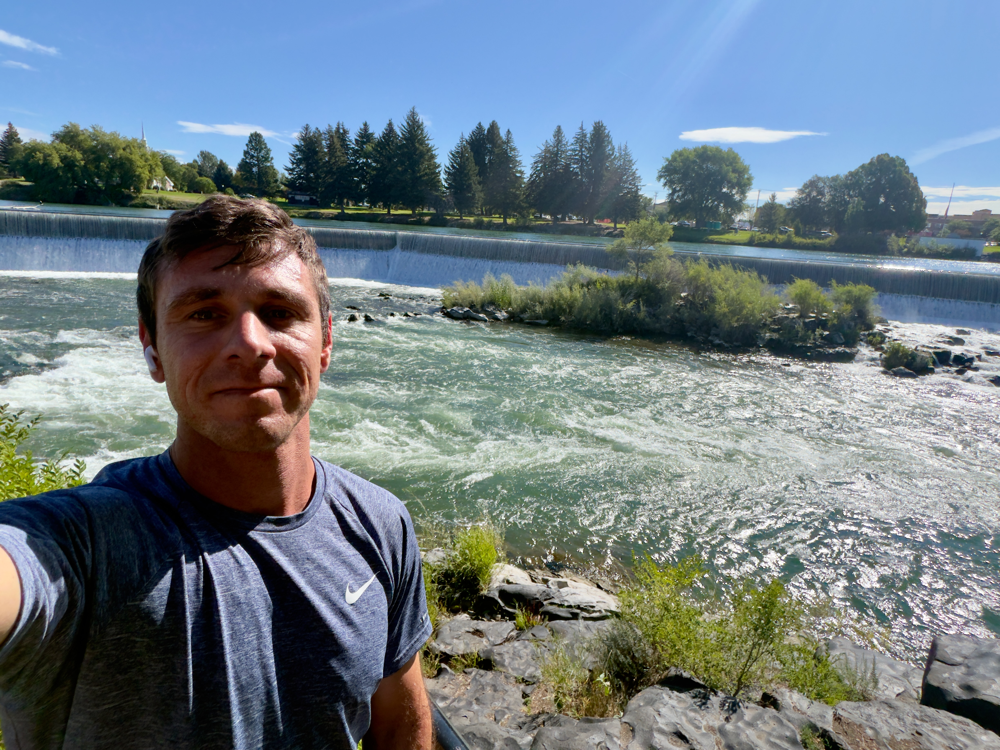
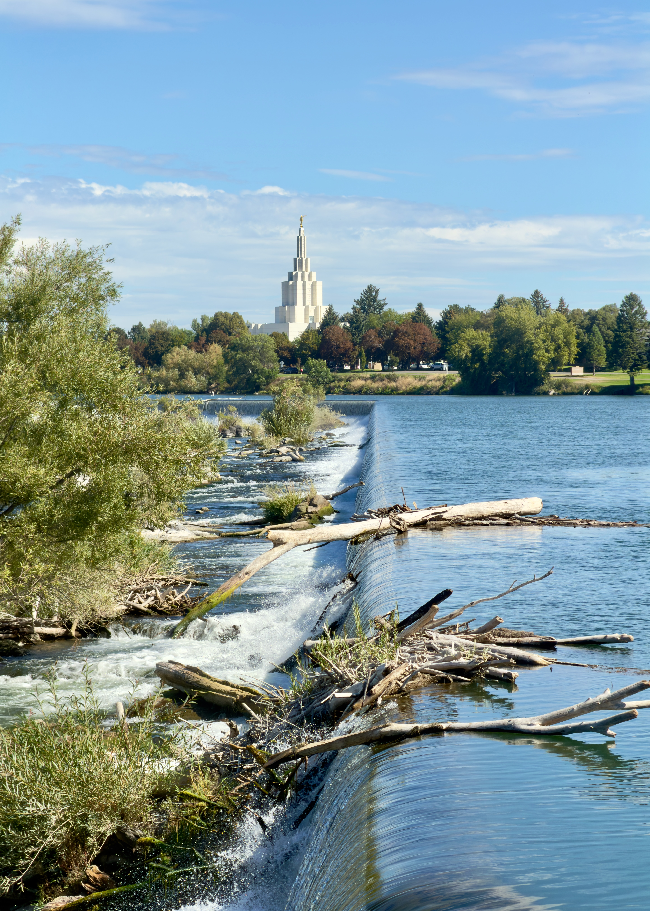
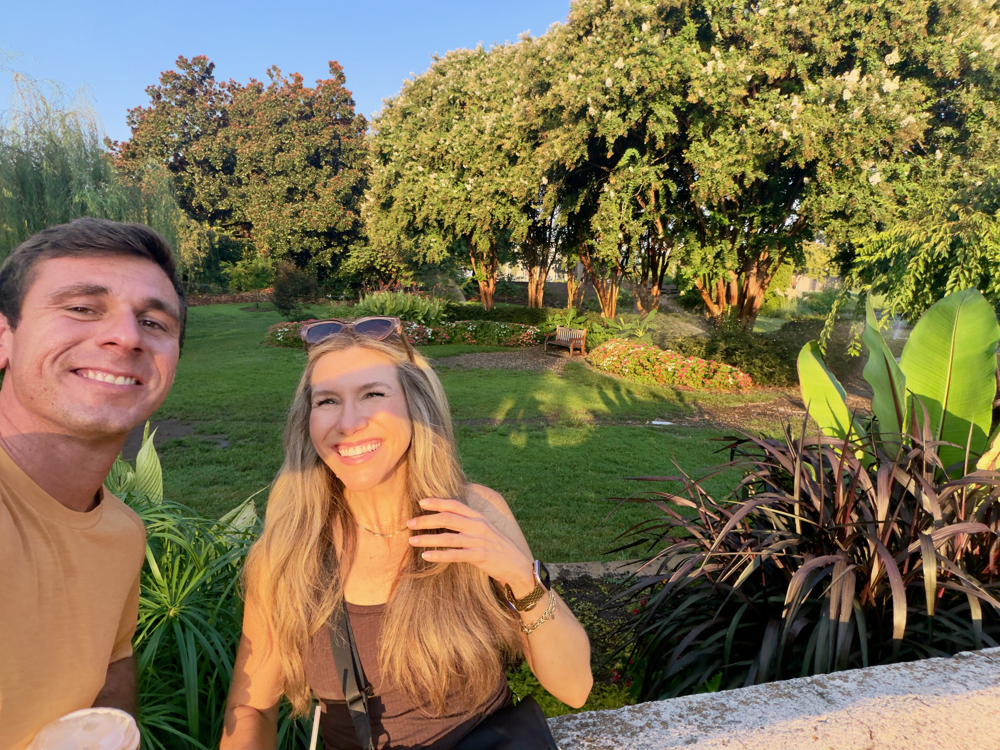
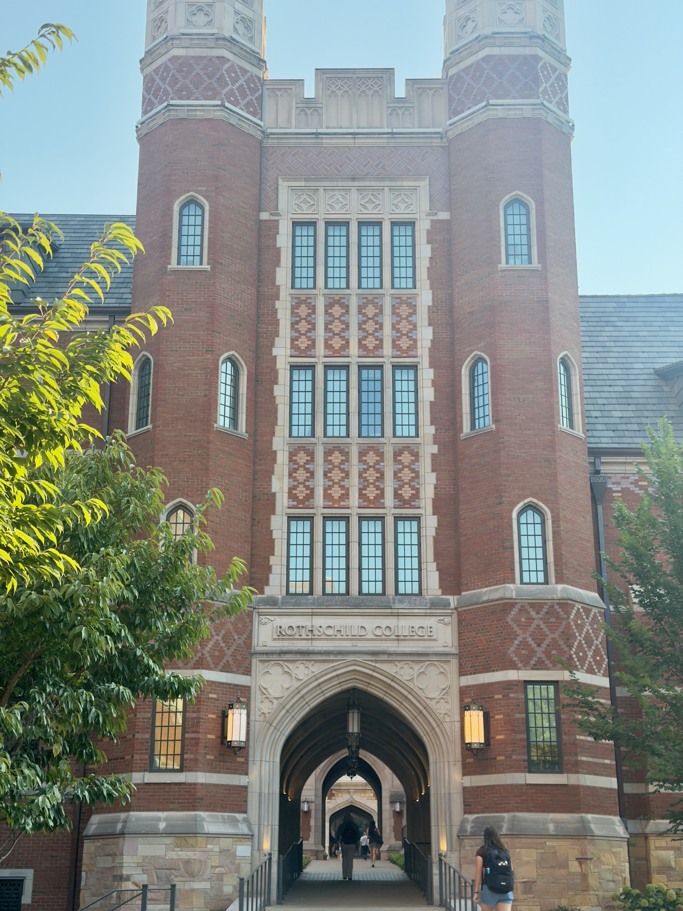

The full [photo album is here 📸](https://photos.turtle-tracks.com/s/2026-09-03-ida)

## Idaho Falls, Idaho (IDA)
I arrived in DFW yesterday, 2 Sep 2026, and was initially assigned out-of-base reserve (OBR) for the remainder of reserve block (2-6 Sep) in DEN, but that quickly changed to this: 
2 Sep: DFW-IDA, overnight IDA (Idaho Falls)
3 Sep: IDA-ORD, overnight ORD 
4 Sep: deadhead ORD-DEN*
4-6 Sep: OBR 

Always grateful for some flight hours, I graciously accepted (because I totally have a choice 😜) the schedule change. DFW to IDA is one of the longer CRJ legs my airline operates, and it was about 2.3 block hours - almost mainline status! I flew with a CA who had one of the more humbling life stories that I've heard. It was a refreshing change of pace.

*This later changed to:
4 Sep: IDA-DEN-BNA
5 Sep: BNA-DEN --> DEN OBR
6 Sep: DEN OBR

### The Falls
Unsure of what the "falls" referred to in Idaho Falls, I had to find out. But first, the hotel gym (Best Western) was used. It was not bad, complete with a pulley machine. This leads to a new site feature, which I'll expand upon following this. Back to these falls - I rented a bike courtesy of the hotel, and set foot on a short bike ride

  
  
  
  


### Nashville, Tennessee (BNA)

Thanks to last minute scheduling changes, I had a quick overnight in Nashville - where my older sister lives. I had to fly out the next morning early, but she graciously drove downtown to meet me for a nice walk through Centennial Park and Vanderbilt University. The park was quite large for major American city downtown, and very well maintained. The university had a **very** Hogwarts vibe to it - likely with a corresponding need to perform magic to come up with the tuition! Always nice to see family. 

## Site and Self-Host Updates
Three major updates & changes that are either already implements or will be soon: 
1. "Gym/hotel tracker" 
    This is a page with a simple markdown table which has gym equipment available at the various hotel gyms I go to. Other stuff will be annotated as appropriate (i.e., free breakfast)
2. Photo hosting: PhotoPrism --> Immich*
    I've been hosting a PhotoPrism instance on a Raspberry Pi 4B*  for the past ~18 months as an experiment. It has ran pretty well in the limited use it's seen, but I plan on migrating all of my media to a single source. iPhone, Fujifilm X-T2, GoPro --> Immich. I take the majority of my pictures with an iPhone, carrying a X-T2 for the thousands of miles I travel per month is just not feasible (or I haven't found a good way to do it, anyways). Over PhotoPrism, Immich offers one thing -- background + automatic iOS syncing. I take pics on my phone, overnight those pics get uploaded to Immich. Simple and painless. Post trip I clean up those pics and organize + tag, and bam, I have a photo library. X-T2 and GoPro footage gets manually added, just as how I've always done anyways. 
3. Location tracker: a simple map with pins for the places I've visited. For use on trip reports. 

*The rPi 4B will be replaced with a mini PC of some sort, eventually, when I find a suitable replacement on FB marketplace. It's served me well, but I don't think it will be up to the task of serving as my primary media host. Mix of requirements\* and nice to haves for the rPi's replacement: 
1. DIN rail mountable
2. 16 GB RAM\*
3. At least one NVME SSD slot --> ~2TB m.2 SSD? 
4. A SATA SSD/HDD connector   --> ~12TB SSD (or maybe a HDD will be adequate?)
5. i7 CPU? For Immich ML accelerated image processing, Intel is supported, AMD Ryzen is not? 

The plan will be to install the OS (likely a Debian minimum server), Immich container, associated thumbnails and image cache on the m.2 SSD. Mass image/video storage will go on the SATA SSD/HDD. 

_I spent way too much time using Mermaid shortcode to draw the below infrastructure diagram_

**Proposed Media Infrastructure**

flowchart TB
  subgraph capture["Capture"]
    phone["iPhone Immich app, overnight background sync"]
    xt2["Fujifilm X-T2 manual import"]
    gopro["GoPro Hero 9 manual import"]
  end

  pi["Raspberry Pi 5 Immich today"]

  subgraph m80q["Lenovo M80q, i5-12500T, 32 GB, Debian 13 (crushbox)"]
    subgraph compose["Docker Compose, Immich v3.2.0"]
      server["immich-server port 2283"]
      ml["machine-learning CLIP · faces · OCR · duplicates CPU now, QuickSync later"]
      db[("Postgres + VectorChord")]
      valkey[("Valkey")]
    end
    nvme[("NVMe 2 TB OS · thumbs · postgres")]
    sata[("SATA SSD 4 TB originals")]
  end

  subgraph access["Access"]
    cf["Cloudflare Tunnel photos.turtle-tracks.com"]
    ts["Tailscale admin only"]
  end

  phone --> server
  xt2 --> server
  gopro --> server
  pi -. "migration staged, not live" .->
  server --> ml
  server --> db
  server --> valkey
  db --- nvme
  server -- "cache" --> nvme
  server -- "library, upload" --> sata
  cf --> server
  ts --> server
