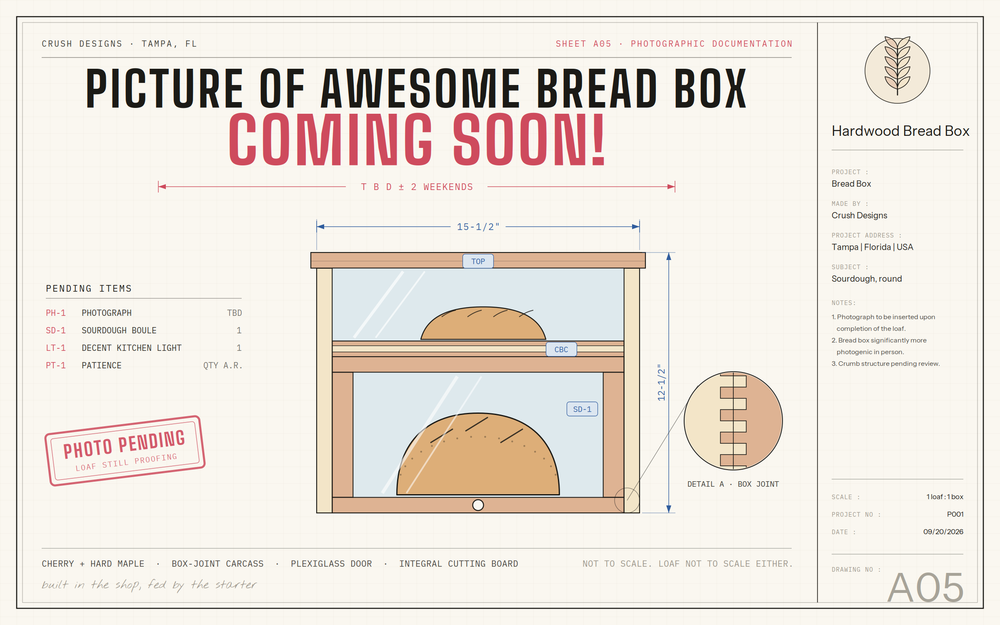
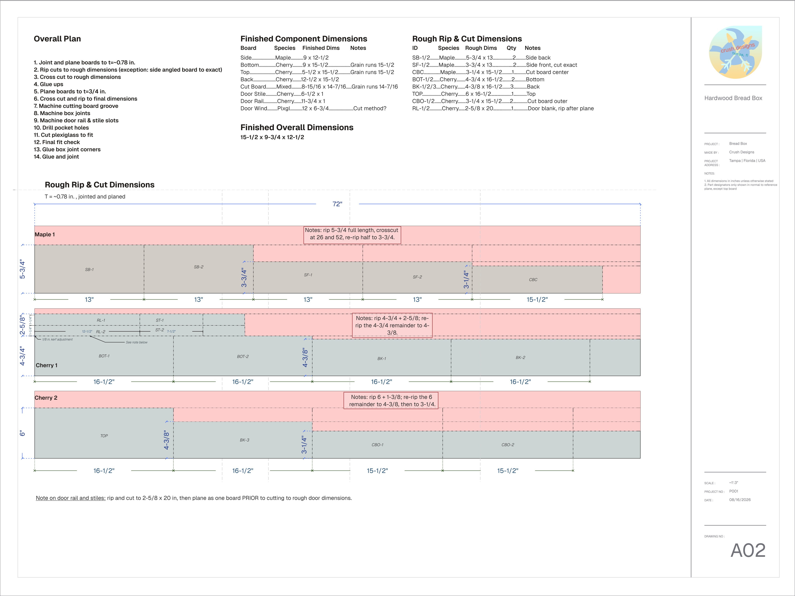

<!-- Put photos in this folder. Reference each one by filename:
     
     The first file with "featured" in its name becomes the card thumbnail. -->



## Grapevine, Texas

Full photo album [here.](https://photos.turtle-tracks.com/share/f1CwuuEeCp5lyd9f9O4CuqASdkfgcjor0rI4zfA1lm0Z9RpHRsF3Dkc22d1AC6RwZ-k)

Reserve in DFW means you live inside a two hour callout and spend a lot of time deciding how far from the crashpad you're willing to wander. Grapevine is the correct answer to that question — Main Street is a five-minute walk from the pad, it is full of fun events, tasting rooms, restaurants, and the annual GrapeFest.

Details for the GrapeFest are [here.](https://www.grapevinetexasusa.com/grapefest/general-information/) 

The entirety of Main St was blocked off and full of food stalls, shops, and pedastrians seeking relief from that late-summer Dallas sun! The best part: there was a Filipino food stand. Chicken adobo satisfies that reserve boredom unlike anything else. 


  
  
  


Phone never rang. Some reserve blocks are like that.

## The Bread Box

> [!TIP]+ Photos coming
> Photos for the completed breadbox will be uploaded on 22 Sep 2026.
{icon="comment"}

It's done. Four months, two versions, one recipient.



### V0.1, and why it died

The whole thing started with a [two-story bread box plan on the Kreg
site](https://learn.kregtool.com/plans/two-story-bread-box/). I thought it would
be easy.

It was not. I started in April 2026 and found out in about a weekend that
precision hardwood work is a different sport than ripping plywood and 2x4s.
Hardwood does not forgive a sixteenth the way sheet goods do, and every corner
of that first attempt was a pocket hole screw doing a job it was never meant to
do. I ended up with an incomplete box, a pile of not-great-looking joints, and a
clear picture of the gap between what I wanted and what I could actually cut.

So I stopped, and redrew the whole thing in CAD with finger joints at the
corners. If I'm going to spend this long on something, it may as well look like
I meant it.

### V0.2, on paper

Four sheets, drawn in [Rayon](https://rayon.design), project P001, dated
16 August 2026. The full set lives on the [project
page](/projects/bread-box/) — A01 elevations, A02 rough cuts, A03 glue-ups,
A04 the twelve build steps.


  inches, W × D × H
  18 side-to-bottom, 11 side-to-top
  cut before glue-up, pieces taped in pairs
  one abandoned, one finished


| Spec | |
|---|---|
| **Species** | Soft maple sides · cherry top, bottom, back, and door |
| **Corners** | ½ in box joints, ¾ in deep |
| **Door** | Cherry rails and stiles, plexiglass in a ¼ in groove, pocket-screwed |
| **Cutting board** | Cherry–maple–cherry, 8-15/16 × 14-7/16, slides out the front |
| **Stock thickness** | ~0.78 in rough, 0.75 in final |
| **Finish** | Odie's Oil |

A02 is my favorite sheet in the set. It's a nesting diagram: three boards
(one maple, two cherry), every part placed on them by hand, and the waste
shaded pink so I could see exactly how much lumber I was about to turn into
nothing. It meant I walked into the shop knowing which cut came first instead
of standing at the saw doing arithmetic.

### The build

**Flat before anything else.** Joint, plane to ~0.78, glue up the panels, then
plane down to 0.75. The shop planer maxes out at 15 inches and the bottom and
back panels are 15½ — so those two go through the drum sander instead. That
constraint is written straight into step 5 of the plan.

**The bevel.** 50.5° across the front of both side panels, cut *before* glue-up
with the two pieces taped face to face so they come out as a mirrored pair
instead of two left-handed sides. A04 has the miter gauge setup drawn out. This
is one of those cuts where the setup takes twenty minutes and the cut takes
four seconds. I had never made such a precision angle cut before, but came out satisfied after a few test cuts. 

**Box joints, on scrap first.** Step 8 of the plan is underlined, because I
underlined it: *mill at least two test pieces at ¾ in to calibrate — no real
panel until a test corner fits.* That one line is the actual difference between
V0.1 and V0.2. Not the CAD, not the finger joints — the discipline to burn scrap
until the jig is right instead of finding out on a panel I spent two hours
milling. I used a [Jessem finger joint jig](https://jessem.com/products/box-joint-jig?srsltid=AU7gw4V_udEnc6UyccEKra-sOKE-3eXmocgM5pKn2fMATMrT5y9X1wWk) for the joints. The tutorial videos make it seem quite easy to use, but I was pretty disappointed with the first few joints I produced. However, after several days and about 10 test joints of tinkering, I was quite satisfied with the resulting joints. I was still a bit anxious when it came time to mill the project lumber, but they came out very well. 


  
  
  


**The cutting board.** Cherry–maple–cherry glue-up riding in a ¾ × ¼ groove
routed the full length of both inside faces. The detail I'm proudest of is in
the plan itself: the board's final length gets trimmed *after* the corners are
glued, to the real interior width — not the drawn one. The drawing admits the
box won't come out exactly as drawn, which felt like the first genuinely
experienced thing I've ever put on a set of plans.


  
  


**Finish.** Odie's Oil, wiped on thin and buffed. Cherry and maple sit at about
the same value raw, and the oil is the moment they separate — the cherry goes
warm and the maple stays pale, and the joints you spent all that time on finally
read from across the room. It was my first time using Odie's Oil - which came highly recommended by several people. It was MUCH stickier than I expected on application, and I was genuinely worried it would remain sticky. After a few hours of drying though, it has a very pleasant feel. No stickiness here. 

### Tampa Hackerspace

None of this happens in an apartment. The jointer, the planer, the drum sander,
the table saw with a proper crosscut sled, the box joint jig — all of it belongs
to [Tampa Hackerspace](https://tampahackerspace.square.site), along with the
members who walked past my test corners and told me what I was doing wrong.
Shout out to KJ for tinkering with the finger joint jig with me. 
Worth every dollar of the membership.

### Credits

- **Inspiration** — [Kreg two-story bread box](https://learn.kregtool.com/plans/two-story-bread-box/)
- **Drawings** — [Rayon Design](https://rayon.design)
- **Shop** — [Tampa Hackerspace](https://tampahackerspace.square.site)
- **Photos** — [full album TBD 📸](https://photos.turtle-tracks.com/)

---

The plans call it a bread box. Fifteen and a half inches wide, one plexiglass
window, one cutting board that slides out the front, and a pencil mark under the
finish that nobody will ever see. It lives on a counter in Tampa now, which was
the specification the entire time. Happy baking, Jobelle. 🍞