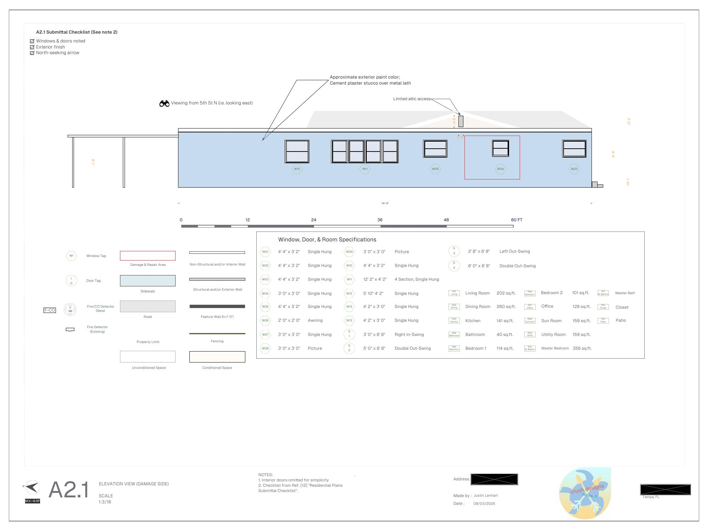
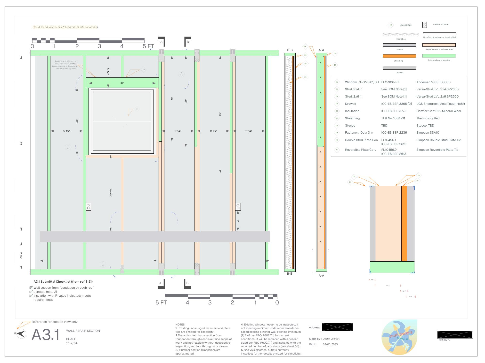
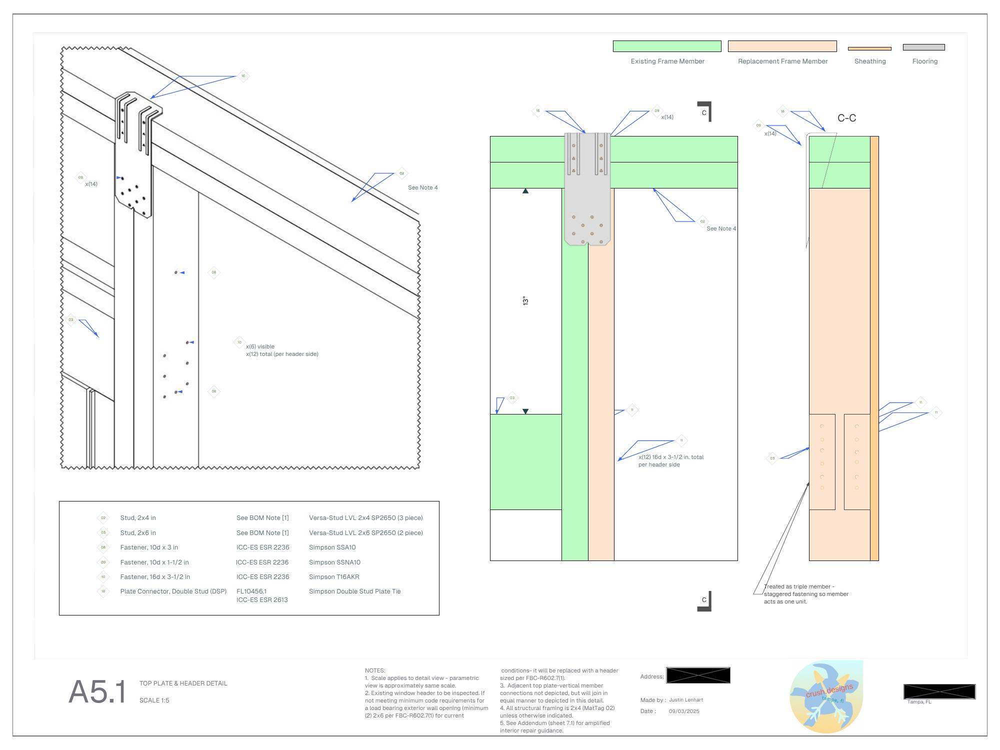
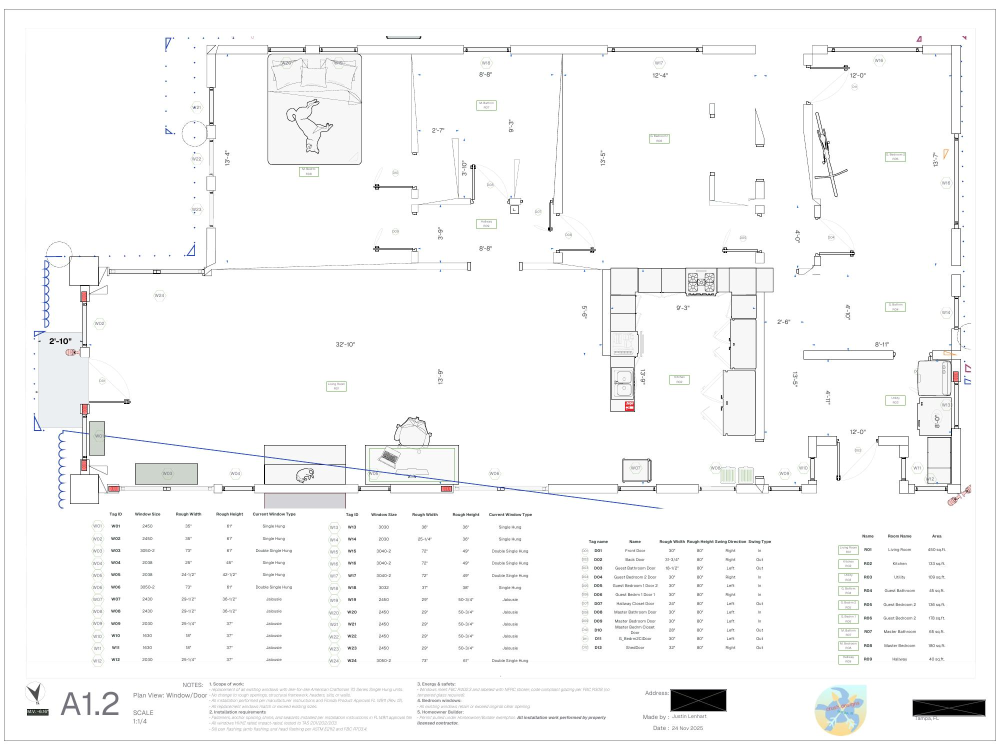
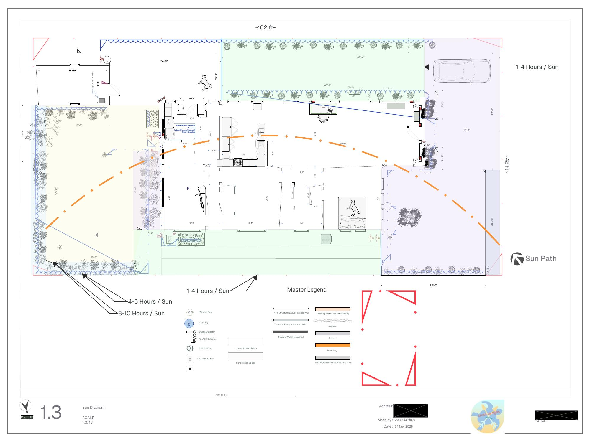
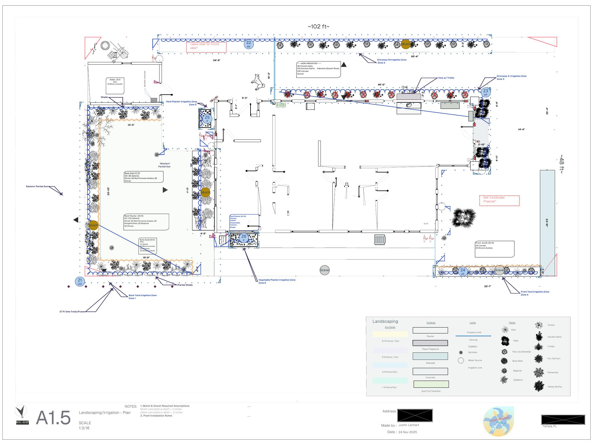

I am not an architect. I am a mechanical engineer with a CAD habit and two
houses that needed work, so I drew the plans myself, submitted them to the
city, and pulled the permits. Both sets below are the actual submittal
packages, with the addresses and contact details blacked out.

## Wall repair, rental house (2025)

A vehicle hit the side of a one-story rental I own and took out part of a
wood-framed exterior wall. I drafted the full permit set, eleven sheets:
site plan, floor plan, damage-side elevation, wall section, top plate and
header detail, bottom plate and sub-floor detail, window and exterior
repairs, and storm shutter installation, with Florida Building Code and
ICC-ES citations on every connector. A licensed contractor did the work.
**The city approved the permit on the first submission.**

[Download the full set (PDF)](house-wall-repair_FinalDraftLowRes.pdf)

## Bungalow renovation, my house (2025 to present)

The house I live in is a 1920s bungalow. This set covers three things, and I
acted as my own contractor and pulled the permits myself:

- **Window replacement.** Like-for-like impact-rated single hungs, drawn
  with the product approval, anchoring schedule, and flashing notes.
  *Implemented.*
- **Landscape and drip irrigation.** Every bed redone, with an
  OpenSprinkler controller running zoned drip lines, connected to Home
  Assistant and HomeKit. *Implemented*, with lessons learned (see the posts
  below).
- **Front yard patio and planters.** A pedestal-deck patio with raised
  planters. *Not implemented*, pending a decision on a larger renovation.

[Download the full set (PDF)](HouseReno_LowRes.pdf)

")
