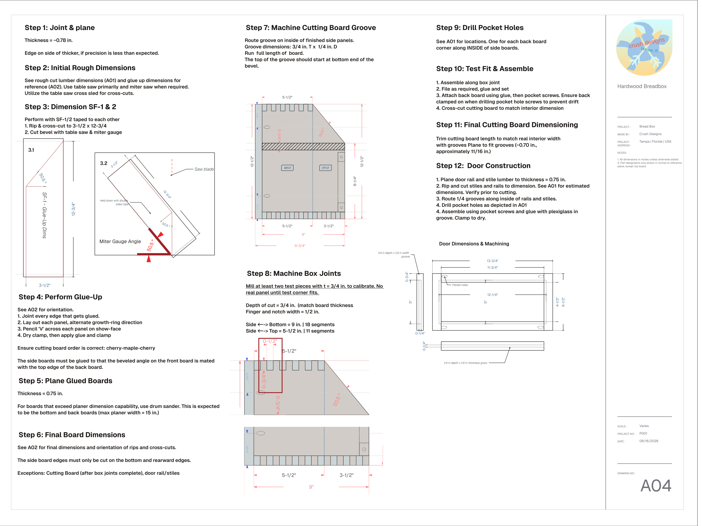

Inspired by a [guide on the Kregg website](https://learn.kregtool.com/plans/two-story-bread-box/). I thought it would be easy...

Originally started in April 2026, but I quickly found out that precision hardwood woodworking is quite challenging, and well beyond my ability to rip and crosscut plywood and 2x4s. My first attempt resulted in an incomplete box cornered with not-great looking pocket hole joints and a realization that my woodworking skills were not to par. 

I decided to redesign the box on CAD and implement finger joints for the corners for a more refined look. If I'm going to spend lots of time on something, it might as well look good, right? 

