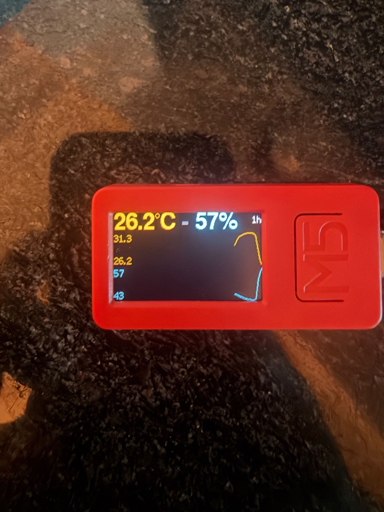

An M5StickC Plus and a DHT20 sensor running
[HomeSpan](https://github.com/HomeSpan/HomeSpan), so it pairs with the Home
app directly over Wi-Fi with no bridge. The screen shows the current reading
and a graph of the last 1 to 72 hours; a small web page on the device lists
the last 24 hours.

Built in a hurry after a water heater flooded a condo.



